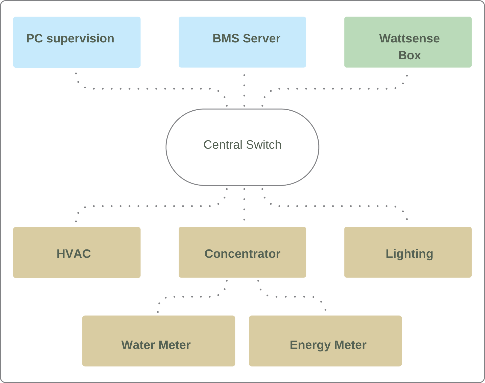

= Box Wattsense - Installation Guide
:Author: Wattsense
:Email: contact@wattsense.com
:Revision: 0.1
:Date: 2019/11/20
:toc: left

ifdef::backend-html5[]
:full-width: width='100%'
:twothird-width: width='75%'
:half-width: width='50%'
:small: width='25%'
endif::[]
ifdef::backend-pdf[]
:full-width: pdfwidth='100vw'
:twothird-width: pdfwidth='75vw'
:half-width: pdfwidth='50vw'
:small: pdfwidth='25vw'
endif::[]
ifdef::backend-docbook5[]
:full-width: scaledwidth='100%'
:twothird-width: scaledwidth='75%'
:half-width: scaledwidth='50%'
:small: scaledwidth='25%'
endif::[]

:ws-console: https://console.wattsense.com

== What do you need before starting?

=== Provided material 

* Box 
** Dimensions: 160 x 110 x 55 mm
** Weight: 340 g
* GSM standard antenna 
* LoRa standard antenna 

=== Required material 

* Powerline voltage (100 to 250VAC) to 12V-24V DC power supply
* Cable between the power supply and the Box: 2 wires (red, black), 22 AWG, minimum section: 0.35 mm²
* Flat screwdriver
* Cutting pliers
* Wire stripper

=== Optional hardware depending on the type of connection

* Bus connection cable: 2 wires, 24 AWG, minimum section: 0.22 mm² + braid
* Ethernet cables
* Ethernet switch 
* Echelon U60 FT DIN USB Gateway (for LON FT10)
* High-gain GSM antenna
* High-gain LoRa antenna
* GSM or LoRa antenna cable
* Double-sided high performance adhesive tape
* Technical documentation of equipment
* Technical documentation of IoT sensors
* Schematic of the communication network(s) of the BMS

=== Computer access to the Wattsense console

* Each customer has a dedicated space on the Wattsense User Console at https://console.wattsense.com. This interface allows them to manage their fleet of Boxes.
* A Box must have been activated in advance before it can be fully installed and configured.
* If the Box hasn’t been activated, ask the administrator of the account to create an "installation" access on the Wattsense user console and retrieve the login information (email address and password).
* Once on-site, activate the Box on the console:
** How to Log in to the console: enter the email and password provided by the administrator and click on "Log in".
** Enter the alphanumeric identifier of the Box in the search rectangle at the top.
** Click on "Activate".
** It is required to give the Box a name in the "Name" field (for example, the name of the site where it will be installed).
** If necessary, add additional information in the "Description" field in order to clearly identify the Box (for example the floor or the precise place of installation if on the same site there are several Boxes).
** Click on "Activate the Box".
* You will then be able to access the configuration tools.

== The power supply of the Box

Make sure that the Box has been activated beforehand on the user console.

* Ideally, place the Box in an electrical enclosure or cabinet.
* Attach the Box:
** Mount the Box on a DIN rail.
+
image::images/box_install_din_rail.png[{twothird-width}]

** Or attach 2 screws to a wall and hook the Box using the notches on the back of the case: Screws of maximum 4 mm in diameter, with a head of maximum 7.5 mm diameter, a spacing of 89.4 mm.
+
image::images/box_install_wall_mount.png[{twothird-width}]

* Use a DC power supply of 12V to 24V, 2A.
* Screw the cable into the power connector of the Box.
+
image::images/box_power_connector_wiring.png[{twothird-width}]

* Connect the cable to the power supply.
+
image::images/box_power_full_wiring.png[{twothird-width}]

* Check that the "Power" LED is lit (steady green light).
+
image::images/box_power_led_on.png[{half-width}]

* Wait for ten seconds: the "Heartbeat" LED flashes (green light).
+
image::images/box_heartbeat_blink.png[{half-width}]

* Wait for the GSM LED to flash; if the LED does not flash after a few minutes, see the GSM Antenna chapter.
+
image::images/box_gsm_led_blink.png[{half-width}]

* Check that the Box appears on the console: the presence indicator of the Box changes from red to green.
* If the Box appears on the console, it is functional; you can go to the connection step of the Box to the equipment and/or the network of the building.
* If the Box does not appear on the console, see the GSM Antenna chapter.

== GSM Antenna

The Box is supplied with a standard GSM antenna.

* If the quality of the GSM signal is good: keep the original antenna installed on the Box.
+
image::images/box_gsm_antenna.png[{small}]

* If the signal quality is insufficient: move the original antenna out of the cabinet; use an RF extension cord with SMA connector, up to 2 meters, + 1 adhesive support to hold the antenna.
* If the signal quality is still insufficient: use a high-gain antenna with a maximum of 10 meters of cable; this antenna can, for example, be moved to the outside or to the other floors to obtain a better signal quality. Please note that, beyond 15 meters of cable, the GSM signal is significantly weakened.

== To connect the Box to the BMS 

* Determine the type(s) of network(s) associated with the BMS (communication protocols between the BMS server and the technical equipment).
* Obtain, if possible, the schematic of the communication network(s) of the BMS.
* Identify where and how the BMS server connects to the building's network. 
+

=== In case of IP network (Except LON)

Connection: 

* Make sure to have an Ethernet cable
* Connect the cable to the Ethernet port of the Box ETH1 or ETH2. 
+
image::images/box_ip_eth_plug.png[{half-width}]

* Connect the Box to the switch (IP network) on which the supervision PC/BMS server is connected.
* Check that the ETH1 or ETH2 LED lights up.
+
image::images/box_ip_eth_led_on.png[{half-width}]

Configuration:

* If there is not a  DHCP server on the network, attribute a static IP address to the Box (Discuss with the building’s IT manager).
* If there is a DHCP server on the network, the address is automatically assigned.

Information to retrieve in preparation for the configuration:

* For each device that communicates in Modbus IP 
** From the BMS software, perform an extract of the available properties: list the data types provided by the different devices to which the BMS has access.
** If it is impossible to retrieve this information, recuperate the IP address and TCP port (and if needed, for some devices, the slave address (Slave ID), the brand, and model of the equipment, and extra identifying information. This information is necessary for the installation configuration and to retrieve data.
* In the case of a BACnet IP network
** Write down the BACnet port of the network. This information will be necessary for the installation configuration and to retrieve data.

=== In case of LON IP-852 network 

Connection:

* Make sure to have an Ethernet cable.
* Connect the cable to the Ethernet ports of the Box ETH1 or ETH2.
+
image::images/box_ip_eth_plug.png[{half-width}]

* Connect the other end of the cable to the IP-852 server on the LON network.
+
image::images/lon_ip_gateway_network.png[{twothird-width}]

* Verify that the ETH1 or ETH2 LED lights up
+
image::images/box_ip_eth_led_on.png[{half-width}]

* Register the IP address of the Box on the IP-852 server of the LON network; the IP-852 server’s password is probably required.

Information to retrieve in preparation for the configuration:

* Write down the neuron-ID, brand and model of the equipment, and any identifying information. This information will be necessary for the installation configuration and to retrieve data.
* If you have the NL220 software, export the LON database as an archive file or as an NLC file.

=== In case of LON FT10 network

Connection: 

* Make sure to have a USB Echelon U60 FT DIN gateway. 
+
image::images/lon_ft10_echelon_u60.png[{half-width}]

* Connect this gateway to the USB port 1 or 2 of the Box.
+
image::images/lon_ft10_echelon_gateway.png[{half-width}]

* Connect also this gateway to the LON FT10 network. 
+
image::images/lon_ft10_echelon_gateway_to_network.png[{twothird-width}]

Information to get  in preparation for the configuration:

* Write down the Neuron-ID, brand and model of the equipment, and any identifying information. This information will be necessary for  the installation configuration and to retrieve data.
* If you have the NL220 software, export the LON database as an archive file or as an NLC file.

== To connect the Box directly to the technical equipment in the absence of a BMS

* Prepare the list of equipment to be connected and their respective communication protocols.
* Collect the technical documentation of each manufacturer to know where and how to connect to its devices (user console, configuration wizard, manufacturer's site, etc.).
* Draw up an installation schematic.

=== The equipment communicates in Modbus IP 

To connect only 1 equipment

* Make sure to have an Ethernet cable.
* Connect the cable to the Ethernet port of the Box ETH1 or ETH2.
+
image::images/box_ip_eth_plug.png[{half-width}]

* Connect the other end of the cable to the equipment.
* Verify that the ETH1 or ETH2 LED lights up.
+
image::images/box_ip_eth_led_on.png[{half-width}]

To connect 2 devices

* Make sure to have 2 Ethernet cables.
* Connect the cables to the Ethernet ports of the Box ETH1 and ETH2.
+
image::images/box_ip_dual_eth_plug.png[{half-width}]

* Connect the cables to the 2 devices.
* Check that the ETH1 and ETH2 LEDs light up. 
+
image::images/box_ip_both_eth_led_on.png[{half-width}]

To connect 3 equipment or more make sure to:

* Have an Ethernet cable for the Box.
* Have as many Ethernet cables as equipment to connect.
* Have an Ethernet switch.
* Connect the switch to the power supply
* Connect an Ethernet cable to the Ethernet port of the Box ETH1 or ETH2.
+
image::images/box_ip_eth_plug.png[{half-width}]

* Connect the other end of this cable to the Ethernet switch.
+
image::images/box_ip_eth_switch.png[{twothird-width}]

* Check that the ETH1 or ETH2 LED lights up.
+
image::images/box_ip_eth_led_on.png[{half-width}]

* Connect all equipment to the switch via the Ethernet cables.

To configure each of the equipment

* Using the technical documentation of the equipment, find its IP address and TCP port (and if necessary, for some devices, the address of the slave "Slave ID").
* If the equipment does not have an IP address, assign one to it, 192.168.1.1 for the first device, then 192.168.1.2 for the second device, 192.168.1.3 for the third device, and so on.
* Write down the IP address and TCP port (and if necessary, for certain devices, the address of the Slave ID), the brand and model of the equipment, and any information that allows it to be identified. This information will be necessary for the installation configuration and to retrieve data.

=== The equipment communicates in Modbus RTU (RS485)

Organization of the Bus architecture:

* Gather the necessary information for each device: Bus speed, character size, parity bit, stop bit (from the user console's configuration wizard, get the manufacturer's technical documentation, or directly from the control panels of the equipment).
* The goal is to create a maximum of 2 networks, each grouping equipment with the same communication configuration and assign them to the 2 RS485 ports of the Box.
* If the characteristics of the equipment need to constitute more than 2 homogeneous networks, it is necessary to order another Box.
+
image::images/rs485_ok_compat_equip.png[{twothird-width}]
+
image::images/rs485_wrong_no_equip_compat.png[{twothird-width}]
+
image::images/rs485_right_2networks_compat.png[{twothird-width}]

To connect the equipment:

* Caution: Do not group together devices with different communication parameters on the same Bus.
* Serial wire the network or each of the 2 networks.
+
image::images/rs485_good_wiring.png[{twothird-width}]
+
image::images/rs485_bad_wiring.png[{twothird-width}]

* Connect the network to an RS485 port of the Box 
+
image::images/rs485_plug_details.png[{twothird-width}]

To configure each one of the equipment

* Configure the address of the 1st Modbus slave to 1, the 2nd to 2, the 3rd to 3 and so on.
* Caution: A network must not contain multiple slaves with the same address.
* Write down the network to which the equipment is connected as well as its address, brand, and model of the equipment and any identifying information. This information will be necessary for the installation configuration and to retrieve data.

=== The equipment communicates in BACnet IP

To connect 1 equipment

* Make sure to have an Ethernet cable.
* Connect the cable to the Ethernet port of the Box ETH1 or ETH2.
+
image::images/box_ip_eth_plug.png[{half-width}]

* Connect the other end of the cable to the equipment.
* Verify that the LED ETH1 or ETH2 lights up.
+
image::images/box_ip_eth_led_on.png[{half-width}]

To connect 2 or more devices

* Make sure to have an Ethernet cable for the Box.
* Make sure to have as many Ethernet cables as equipment to connect.
* Make sure to have an Ethernet switch.
* Connect the power supply to the switch.
* Connect an Ethernet cable to the Ethernet port ETH1 or ETH2 of the Box.
+
image::images/box_ip_eth_plug.png[{half-width}]

* Connect the other end of this cable to the Ethernet switch.
* Check that the ETH1 or ETH2 LED lights up.
+
image::images/box_ip_eth_led_on.png[{half-width}]

* Connect all equipment to the switch via the Ethernet cables.
+
image::images/box_ip_eth_switch.png[{twothird-width}]

To configure each of the equipment

* From the technical documentation of the equipment, retrieve its IP address and the BACnet port.
* If the equipment does not have an IP address, assign one to it, 192.168.1.1 for the first device, then 192.168.1.2 for the second device, 192.168.1.3 for the third device, and so on.
* Write down the IP address and BACnet port, the brand, and model of the equipment, and any other identifying information. This information will be required to configure the installation and to retrieve data.

=== The equipment communicates in LON FT10

To connect the equipment

* Make sure to have an Echelon U60 FT DIN USB Gateway.
+
image::images/lon_ft10_echelon_u60.png[{half-width}]

* Connect it to the USB port 1 or 2 in the Box.
+
image::images/lon_ft10_echelon_gateway.png[{twothird-width}]

* Wire the gateway to different devices as you wish, in serial, star, etc.
+
image::images/lon_ft10_echelon_gateway_to_network.png[{twothird-width}]

To configure each of the equipment

* Retrieve the Neuron-ID that appears on the equipment.
* Write down the Neuron-ID, brand, model of the equipment, and any identifying information. This information will be necessary for the   installation configuration and to retrieve data.
* If you have the NL220 software, export the LON database as an NLC file.

=== The equipment communicates in LON IP-852

To connect 1 or several equipment.

* Make sure to have an Ethernet cable.
* Connect the cable to the Ethernet port of the Box ETH1 or ETH2.
+
image::images/box_ip_eth_plug.png[{half-width}]

* Connect the other end of the cable to the IP-852 server of the LON network.
+
image::images/lon_ip_gateway_network.png[{twothird-width}]

* Verify that the LED ETH1 or ETH2 lights up.
+
image::images/box_ip_eth_led_on.png[{half-width}]

* Register the IP address of the Box on the IP-852 server of the LON network.

To configure each of the different equipment

* Write down the Neuron-ID, brand, model of the equipment, and any identifying information. This information will be necessary for the installation configuration and to retrieve data.
* If you have the NL220 software, export the LON database as an archive file or as a NLC file.

=== The equipment communicates in LPB 

To connect 1 or several equipement

* Connect the LPB Bus to the X-Bus port of the Box.
* Each device must connect its MB signal to the X-Bus signal (-) and its DB signal to (+).
+
image::images/lpb_plug_details.png[{half-width}]

To configure each of the devices

* As a precaution, check that the equipment does not power the LPB Bus.
* For each device, configure a unique segment address (from 1 to 14).
* Proceed to make the connection as indicated.
* Designate one and only one equipment as the one that supplies the Bus.

== To connect the Box to LoRaWAN sensors 

Install the Box:

* Install the Box in a central location to ensure the reception of all sensors.
* If the quality of the LoRa signal is good: keep the original antenna installed on the Box.
+
image::images/box_lora_antenna.png[{small}]

* If the signal quality is insufficient: move the original antenna out of the cabinet; use an RF extension cord with a SMA connector up to 2 meters + 1 adhesive support to hold the antenna.
* If the signal quality is still insufficient: use a High-gain antenna with a maximum of 10 meters of cable; this antenna can for example be used outside or in other floors to obtain the best signal quality. 

For each sensor:

* Add the sensor to the user console (available at https://console.wattsense.com) by naming it to be identifiable.
* Send the configuration to the Box.
* Activate the sensor; to do this, use the manufacturer's technical documentation.
* Check on the user console that the sensor is detected.

