= Box Wattsense - Guide d’installation
:Author: Wattsense
:Email: contact@wattsense.com
:Revision: 0.1
:Date: 2019/11/20
:toc: left

ifdef::backend-html5[]
:full-width: width='100%'
:twothird-width: width='75%'
:half-width: width='50%'
:small: width='25%'
endif::[]
ifdef::backend-pdf[]
:full-width: pdfwidth='100vw'
:twothird-width: pdfwidth='75vw'
:half-width: pdfwidth='50vw'
:small: pdfwidth='25vw'
endif::[]
ifdef::backend-docbook5[]
:full-width: scaledwidth='100%'
:twothird-width: scaledwidth='75%'
:half-width: scaledwidth='50%'
:small: scaledwidth='25%'
endif::[]

:ws-console: https://console.wattsense.com

== De quoi avez-vous besoin avant de commencer ?

=== Matériel fourni

* Box
** Dimensions : 160 x 110 x 55 mm
** Poids : 340 g
* Antenne GSM standard
* Antenne LoRa standard

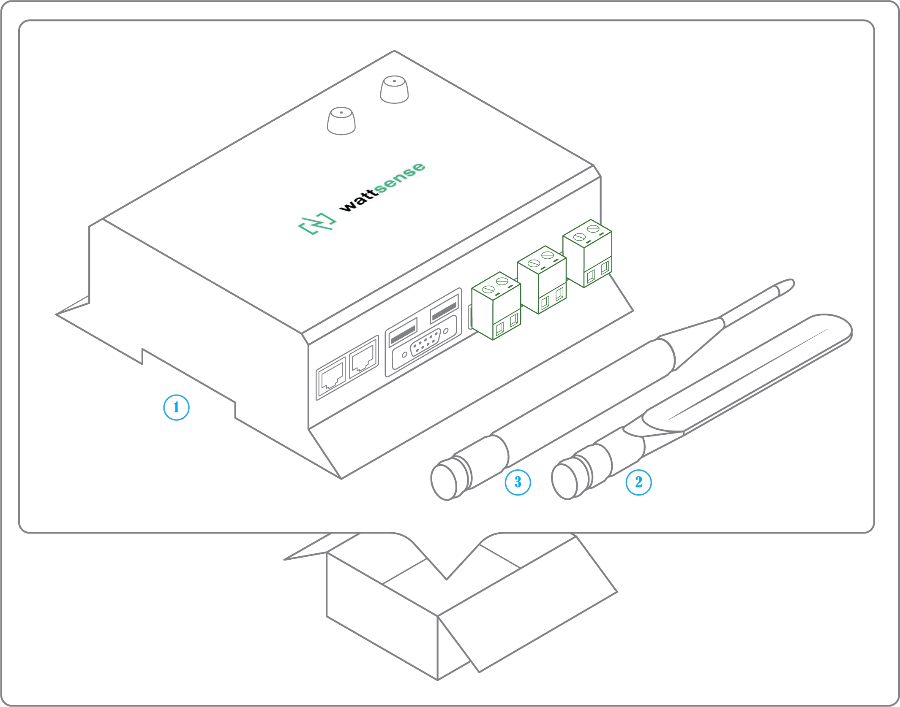

=== Matériel indispensable

* Alimentation 220V vers 12V-24V DC, 2A
* Câble entre l’alimentation et la Box : 2 fils (rouge, noir), 22 AWG, section minimum : 0.35 mm²
* Tournevis plat
* Pince coupante
* Pince à dénuder

=== Matériel optionnel selon le type de connexion

* Câble de raccordement des bus : 2 fils, 24 AWG, section minimum : 0.22 mm² + tresse
* Câble(s) ethernet
* Switch ethernet
* Passerelle USB Echelon U60 FT DIN (pour LON FT10)
* Antenne GSM Grand Gain
* Antenne LoRa Grand Gain
* Câble pour antenne GSM ou LoRa
* Ruban adhésif double face haute performance
* Documentation technique des équipements
* Documentation technique des capteurs IoT
* Schéma du ou des réseau(x) de communication de la GTB

=== Accès informatique à la console Wattsense

* Chaque client bénéficie d’un espace dédié sur la console utilisateur Wattsense à l’adresse {ws-console}.
Cette interface lui permet de gérer son parc de Box.
* Une Box doit avoir été activée au préalable pour pouvoir être complètement installée et configurée.
* S’il n’a pas déjà activé la Box, demander à l’administrateur du compte client de créer un accès « installateur » sur la console utilisateur Wattsense et récupérer les données de connexion (adresse e-mail et mot de passe).
* Une fois sur site, activer la Box sur la console :
** Se connecter à la console : saisir l’e-mail et le mot de passe fournis par l’administrateur et cliquer sur « Se connecter ».
** Saisir l’identifiant alphanumérique de la Box dans le rectangle de recherche en haut.
** Cliquer sur « Activer ».
** Donner obligatoirement un nom à la Box dans le champ « Nom » (par exemple le nom du site où elle va être installée).
** Ajouter éventuellement des informations complémentaires dans le champ « Description » afin de bien identifier la Box (par exemple l’étage ou le lieu précis d’installation si plusieurs Box sont installées dans un même site).
** Cliquer sur « Activer la Box ».
* Vous pourrez ensuite accéder aux outils de configuration.

== Alimentation électrique de la Box

S’assurer que la Box a été activée au préalable sur la {ws-console}[console utilisateur].

* Placer idéalement la Box dans une armoire ou un coffret électrique.
* Fixer la Box :
** Clipper la Box sur un rail DIN.
+
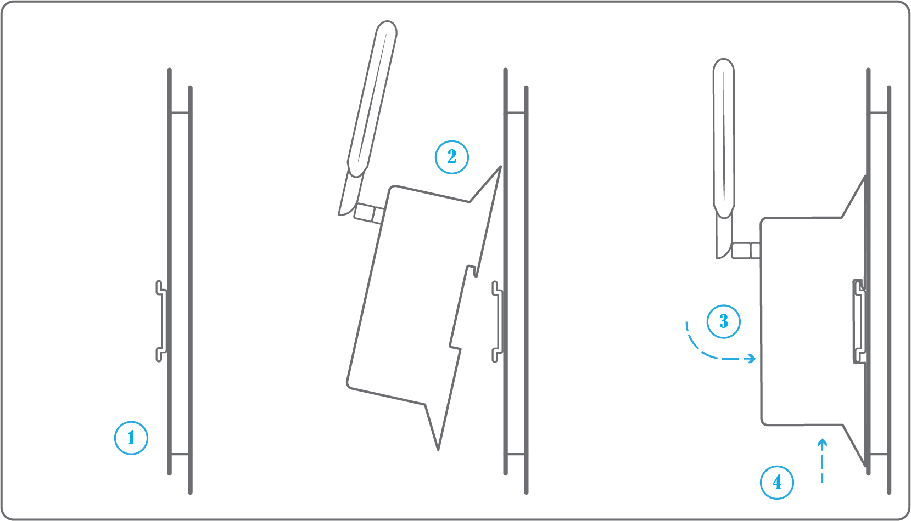

** Ou Fixer 2 vis sur un mur et accrocher la Box en utilisant les encoches au dos du boîtier : vis de 4 mm de diamètre au maximum, avec tête de 7.5 mm de diamètre au maximum, espacement de 89.4 mm.
+
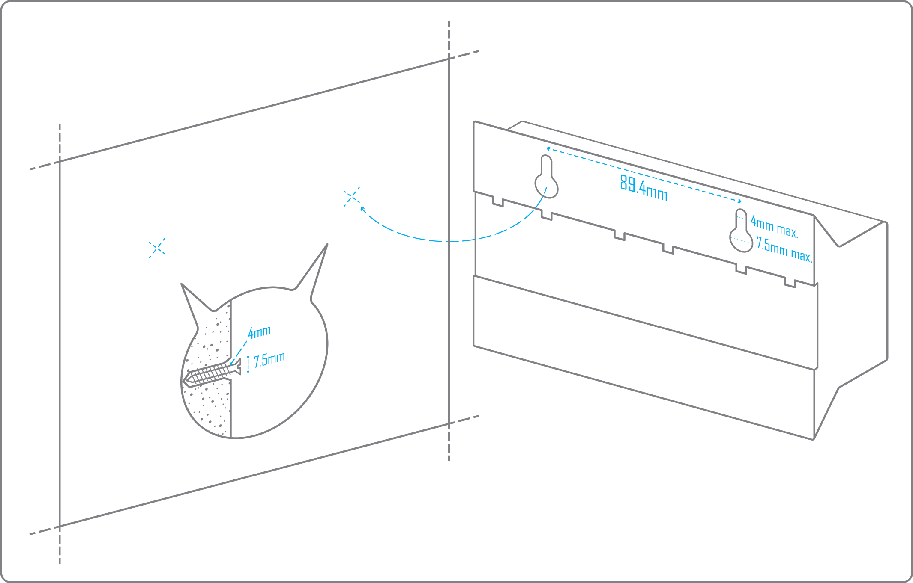

* Utiliser une alimentation électrique DC de 12V à 24V, 2A.
* Visser le câble dans le connecteur d’alimentation de la Box.
+
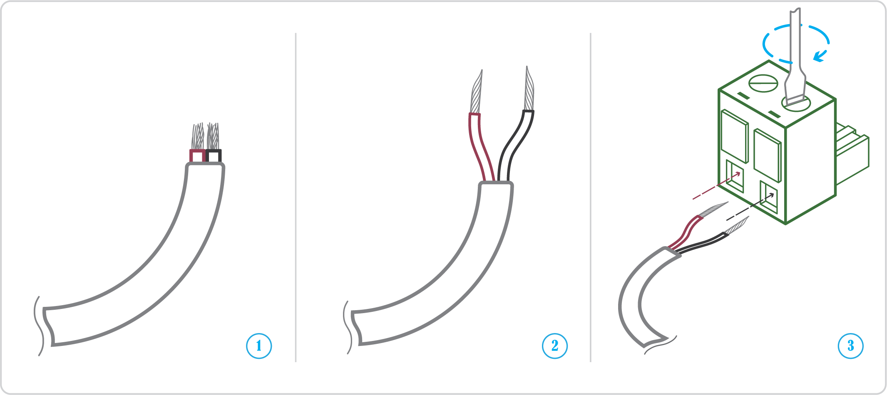

* Connecter le câble à l’alimentation électrique.
+
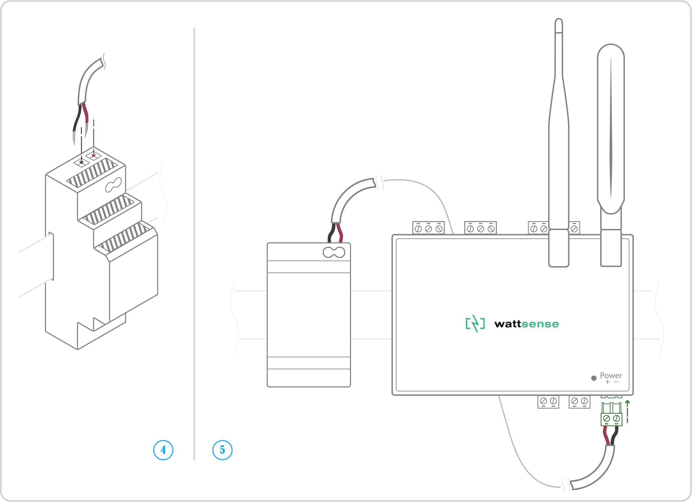

* Vérifier que la LED « Power » est allumée (lumière verte fixe).
+
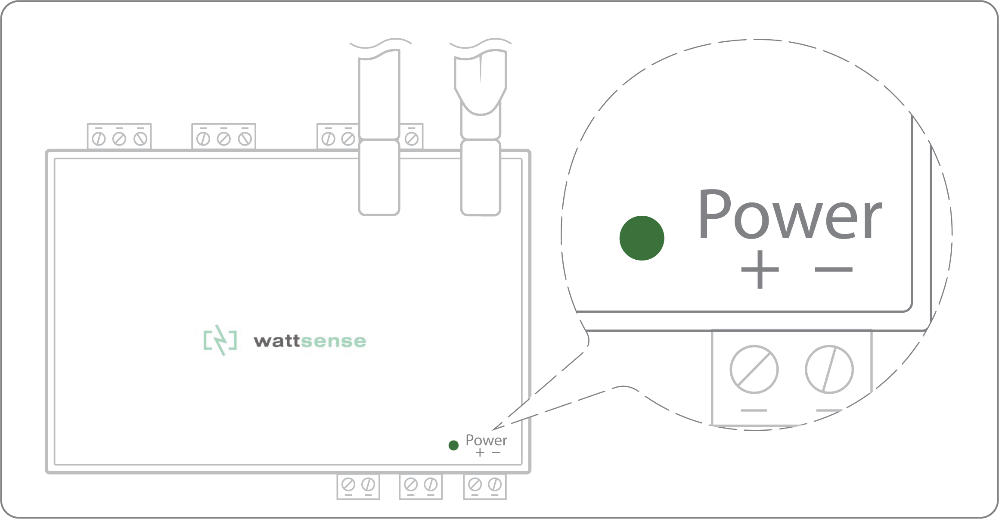

* Attendre une dizaine de secondes : la LED « Heartbeat » clignote (lumière verte).
+
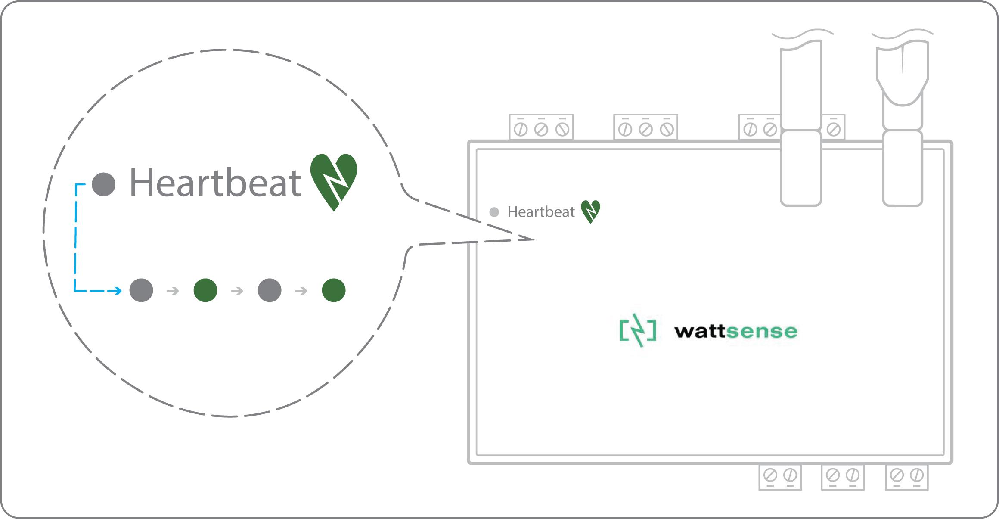

* Attendre que la LED GSM clignote ; si la LED ne clignote pas au bout de quelques minutes, voir chapitre Antenne GSM.
+
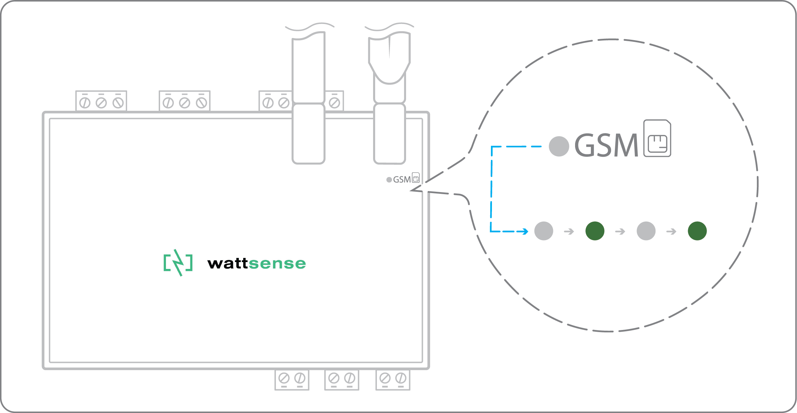

* Vérifier que la Box apparaît sur la console : l'indicateur de présence de la box passe de rouge à vert.
* Si la Box apparaît sur la console, elle est fonctionnelle ; vous pouvez passer à l’étape de connexion de la Box aux équipements et/ou au réseau du bâtiment.
* Si la Box n’apparaît pas sur la console, voir chapitre Antenne GSM.

== Antenne GSM

La Box est fournie avec une antenne GSM standard.

* Si la qualité du signal GSM est bonne : conserver l’antenne d’origine installée sur la Box.
+
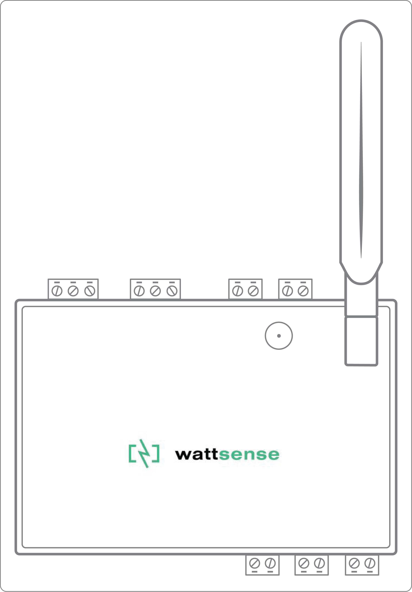

* Si la qualité du signal est insuffisante : déporter l’antenne d’origine à l’extérieur de l’armoire ; utiliser une rallonge de câble RF avec connecteur SMA de 2 mètres maximum + 1 support adhésif pour maintenir l’antenne.
* Si la qualité du signal est toujours insuffisante : utiliser une antenne Grand Gain avec au maximum 10 mètres de câble ; cette antenne peut par exemple être déportée à l’extérieur ou dans les étages pour obtenir la meilleure qualité de signal. Attention, au-delà de 15 mètres de câble, le signal GSM est affaibli de manière significative.

== Pour connecter la Box à une GTB

* Déterminer le ou les type(s) de réseau associé(s) à la GTB (protocoles de communication entre le serveur GTB et les équipements techniques).
* Obtenir au préalable si possible le schéma du ou des réseau(x) de communication de la GTB.
* Identifier où et comment le serveur GTB est connecté au réseau du bâtiment.
+
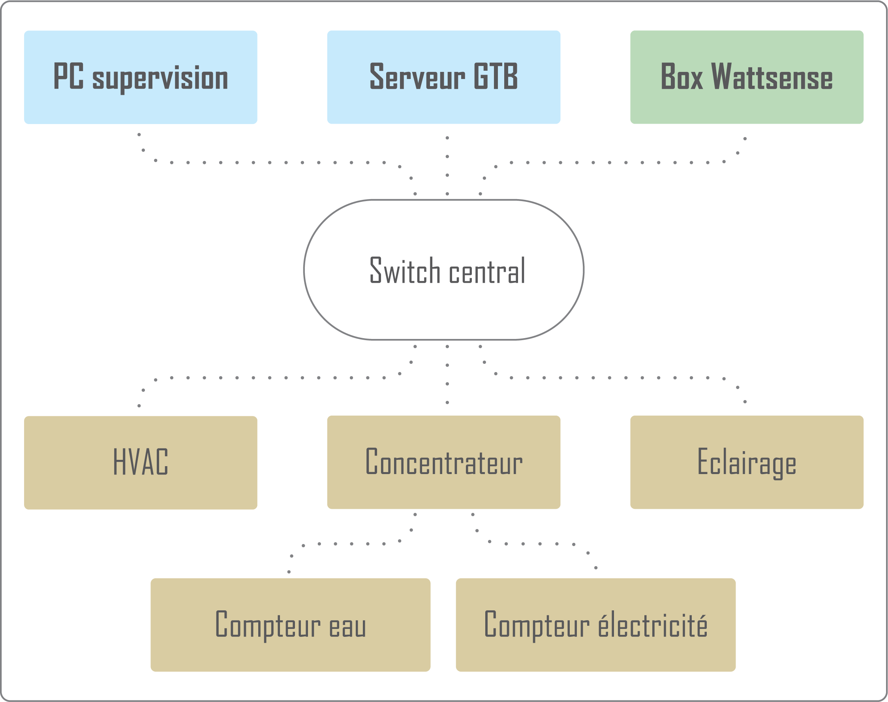

=== En cas de réseau IP (hors LON)

Connexion :

* Prévoir un câble ethernet.
* Connecter le câble au port ethernet de la Box « ETH1 » ou « ETH2 ».
+
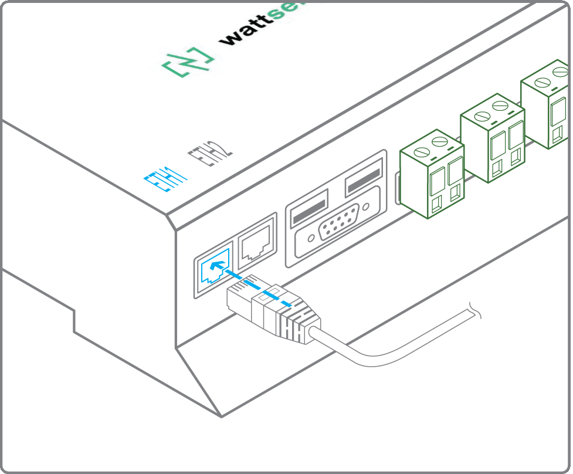

* Connecter la Box au switch (réseau IP) sur lequel est connecté le PC de supervision / le serveur GTB.
* Vérifier que la LED ETH1 ou ETH2 s’allume.
+
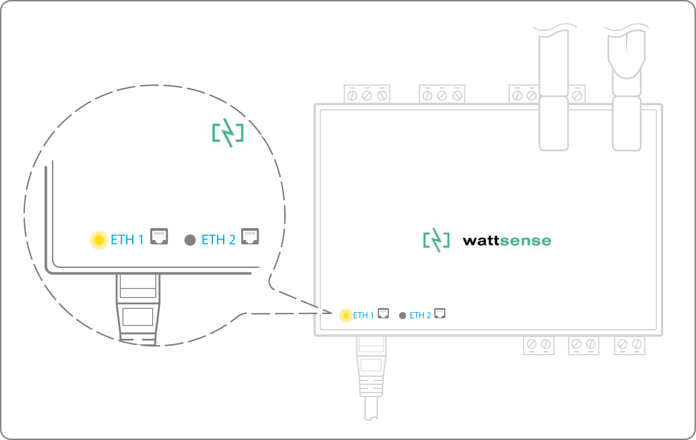

Paramétrage :

* S’il n’existe pas de DHCP sur le réseau, attribuer une adresse IP statique à la Box (voir avec le responsable informatique du bâtiment).
* S’il existe un DHCP sur le réseau, l’adresse est attribuée automatiquement.

Informations à récupérer en prévision de la configuration :

* Pour chaque équipement qui communique en Modbus IP
** Effectuer depuis le logiciel GTB un extrait des propriétés disponibles : liste des types de données fournies par les différents équipements et auxquelles la GTB a accès.
** En cas d’impossibilité d’extraire ces informations, récupérer l’adresse IP et le port TCP (et si besoin, pour certains équipements, l’adresse de l’esclave « slave ID »), la marque et le modèle de l’équipement, et toute information permettant de l’identifier (ces informations seront nécessaires pour la configuration de l’installation et la restitution des données).
* En cas de réseau BACnet IP
** Noter le port BACnet du réseau (ces informations seront nécessaires pour la configuration de l’installation).

=== En cas de réseau LON IP-852

Connexion :

* Prévoir un câble ethernet.
* Connecter le câble au port ethernet de la Box « ETH1 » ou « ETH2 ».
+

* Connecter l’autre extrémité du câble au serveur IP-852 du réseau LON.
+
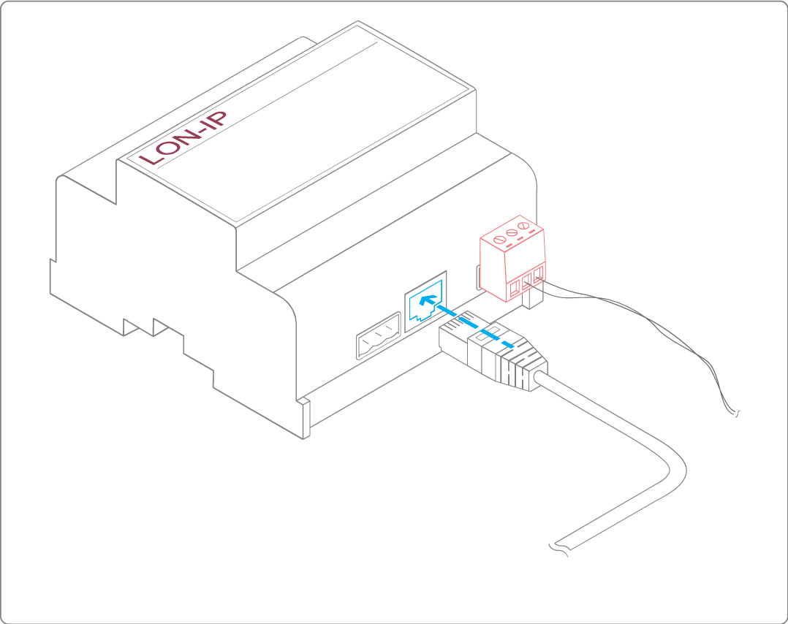

* Vérifier que la LED ETH1 ou ETH2 s’allume.
+

* Enregistrer l’adresse IP de la BOX sur le serveur IP-852 du réseau LON ; le mot de passe du serveur IP-852 est probablement requis.

Informations à récupérer en prévision de la configuration :

* Noter le neuron-ID, la marque et le modèle de l’équipement, et toute information permettant de l’identifier (ces informations seront nécessaires pour la configuration de l’installation et la restitution des données).
* Si vous avez le logiciel NL220, exporter la database LON sous forme d’un fichier archive ou bien sous forme de fichier NLC.

=== En cas de réseau LON FT10

Connexion :

* Prévoir une passerelle USB Echelon U60 FT DIN.
+
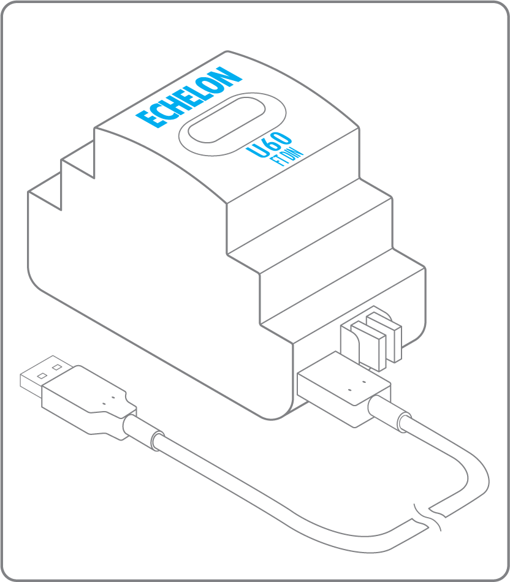

* Connecter cette passerelle au port USB 1 ou 2 de la Box.
+
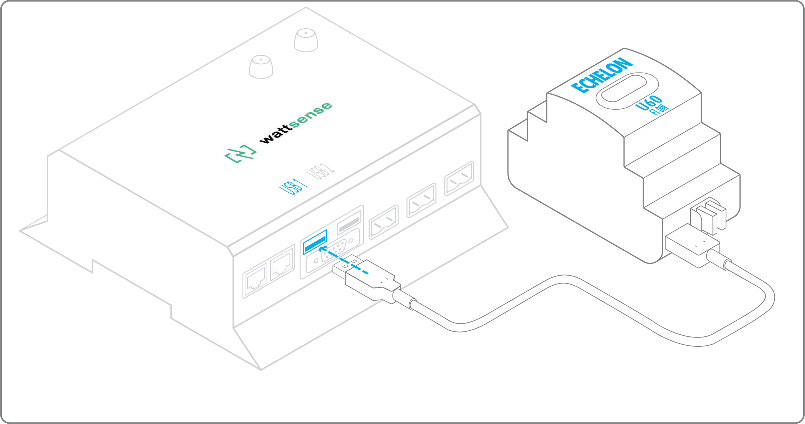

* Connecter aussi cette passerelle au réseau LON FT10.
+
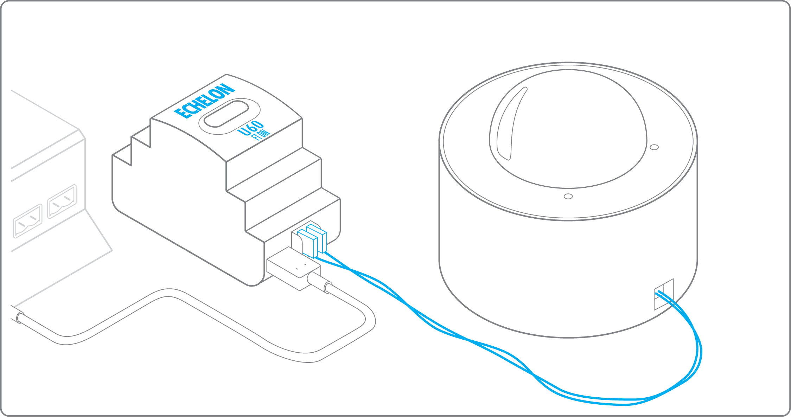

Informations à récupérer en prévision de la configuration :

* Noter le neuron-ID, la marque et le modèle de l’équipement, et toute information permettant de l’identifier (ces informations seront nécessaires pour la configuration de l’installation et la restitution des données).
* Si vous avez le logiciel NL220, exporter la database LON sous forme d’un fichier archive ou bien sous forme de fichier NLC.

== Pour connecter la Box directement aux équipements techniques en l’absence de GTB

* Préparer la liste des équipements à connecter et de leur protocole de communication.
* Réunir la documentation technique de chaque fabricant pour savoir où et comment s’y raccorder (wizard de configuration de la {ws-console}[console utilisateur], site du fabricant, etc.).
* Elaborer un schéma d’installation.

=== L’équipement communique en Modbus IP

Pour connecter 1 seul équipement

* Prévoir un câble ethernet.
* Connecter le câble au port ethernet de la Box « ETH1 » ou « ETH2 ».
+

* Connecter l’autre extrémité du câble à l’équipement.
* Vérifier que la LED ETH1 ou ETH2 s’allume.
+

Pour connecter 2 équipements

* Prévoir 2 câbles ethernet.
* Connecter les câbles aux ports ethernet de la Box « ETH1 » et « ETH2 ».
+
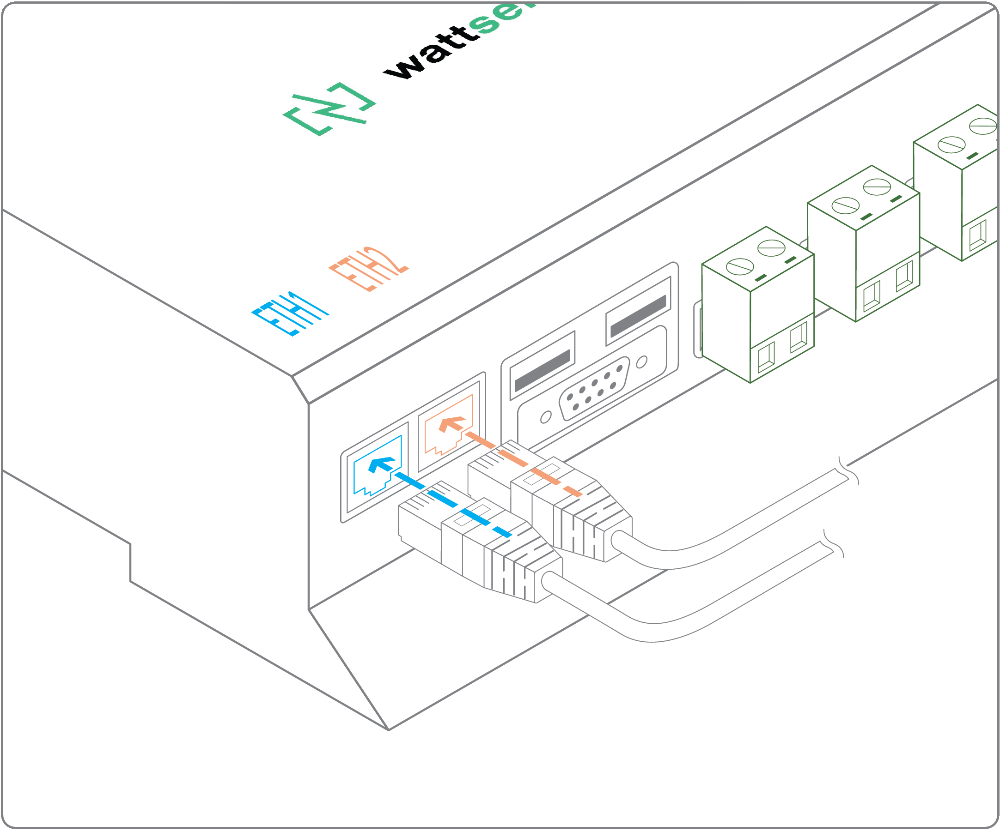

* Connecter les autres extrémités des câbles aux 2 équipements.
* Vérifier que les LED ETH1 et ETH2 s’allument.
+
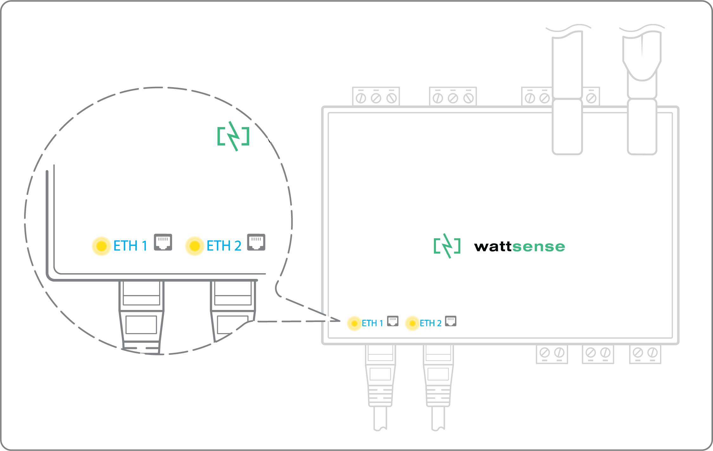

Pour connecter 3 équipements ou plus

* Prévoir un câble ethernet pour la Box.
* Prévoir autant de câbles ethernet que d’équipements à connecter.
* Prévoir un switch ethernet.
* Brancher l’alimentation du switch.
* Connecter un câble ethernet au port ethernet de la Box « ETH1 » ou « ETH2 ».
+

* Connecter l’autre extrémité de ce câble au switch ethernet.
+
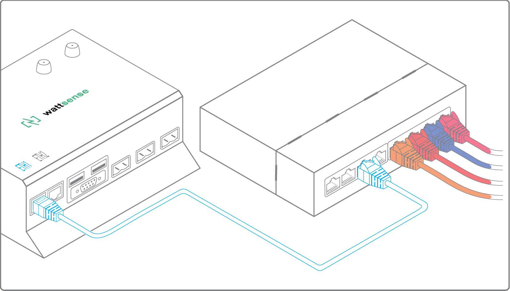

* Vérifier que la LED ETH1 ou ETH2 s’allume.
+

* Connecter tous les équipements au switch via les câbles ethernet.

Pour paramétrer chacun des équipements

* A partir de la documentation technique de l’équipement, récupérer son adresse IP et le port TCP (et si besoin, pour certains équipements, l’adresse de l’esclave « slave ID »).
* Si l’équipement n’a pas d’adresse IP, lui en attribuer une, de type 192.168.1.1 pour le 1er équipement, puis 192.168.1.2 pour le 2e équipement, 192.168.1.3 pour le 3e équipement, et ainsi de suite.
* Noter l’adresse IP et le port TCP (et si besoin, pour certains équipements, l’adresse de l’esclave « slave ID »), la marque et le modèle de l’équipement, et toute information permettant de l’identifier (ces informations seront nécessaires pour la configuration de l’installation et la restitution des données).

=== L’équipement communique en Modbus RTU (RS485)

Organisation de l’architecture des Bus :

* Réunir les informations nécessaires pour chaque équipement : vitesse du Bus, taille du caractère, bit de parité, bit de stop (depuis le wizard de configuration de la {ws-console}[console utilisateur], la documentation technique du fabricant, ou directement dans les panneaux de contrôle de l’équipement).
* L’objectif est de créer au maximum 2 réseaux regroupant chacun les équipements ayant une configuration de communication identique pour les affecter aux 2 ports RS 485 de la Box.
* Si les caractéristiques des équipements impliquent de constituer plus de 2 réseaux homogènes, il est nécessaire de commander une autre Box.
+
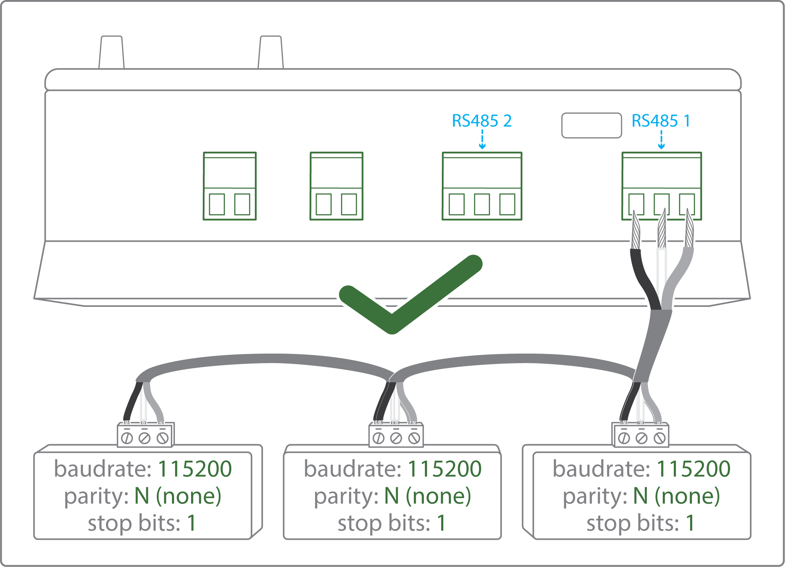
+
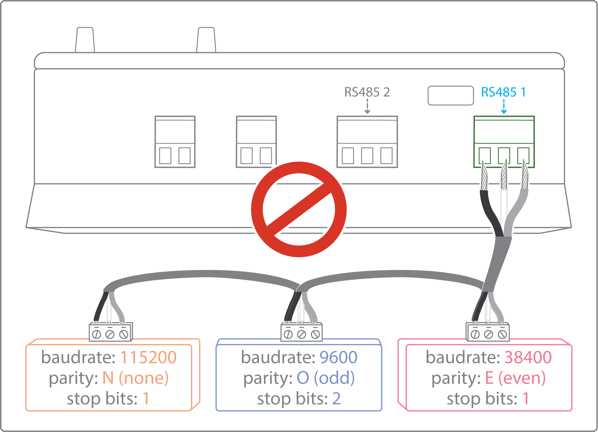
+
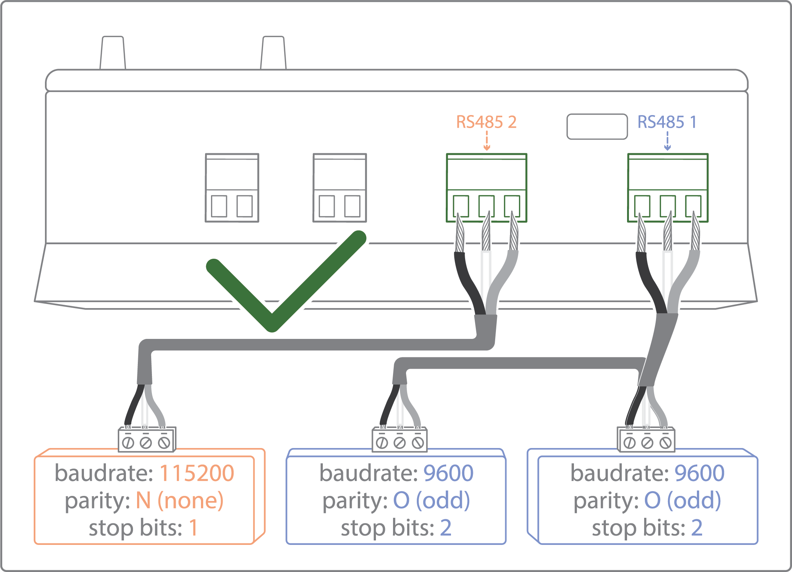

Pour connecter les équipements :

* Attention : Ne jamais regrouper sur le même bus des équipements ayant des paramètres de communication différents.
* Câbler en série le réseau ou chacun des 2 réseaux.
+
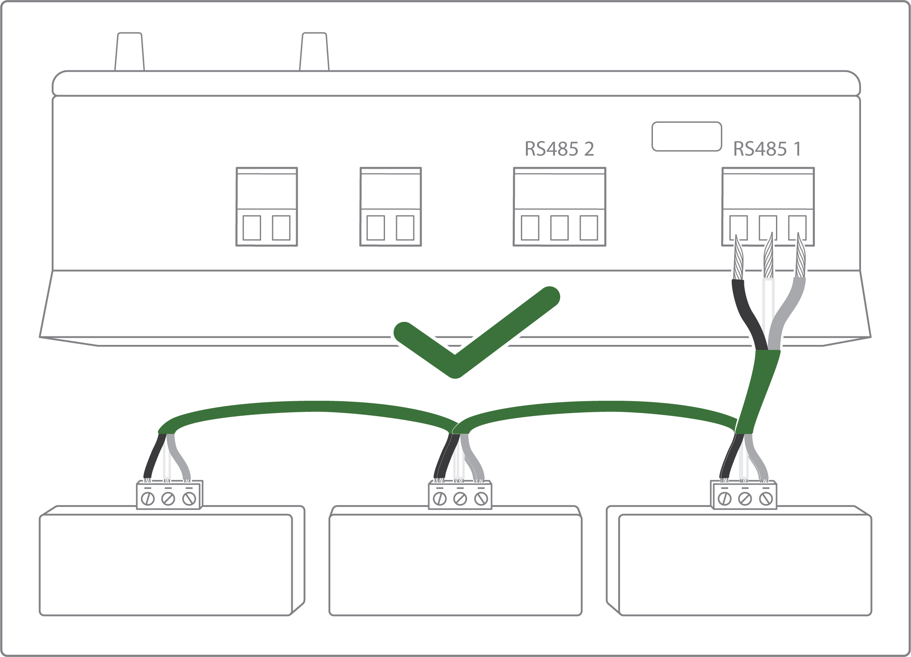
+
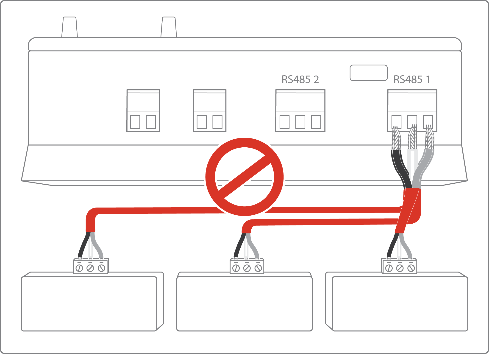

* Connecter le réseau à un port RS485 de la Box.
+
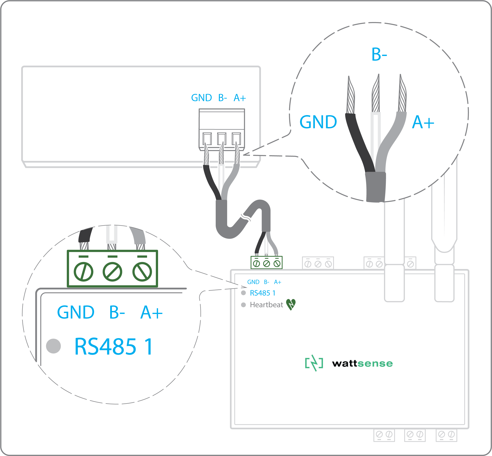

Pour paramétrer chacun des équipements

* Paramétrer l’adresse du 1er esclave Modbus à 1, le 2e à 2, le 3e à 3 et ainsi de suite.
* Attention : Un réseau ne doit pas contenir plusieurs esclaves ayant la même adresse.
* Noter le réseau sur lequel l’équipement est connecté ainsi que son adresse, la marque et le modèle de l’équipement, et toute information permettant de l’identifier (ces informations seront nécessaires pour la configuration de l’installation et la restitution des données).

=== L’équipement communique en BACnet IP

Pour connecter 1 seul équipement

* Prévoir un câble ethernet.
* Connecter le câble au port ethernet de la Box « ETH1 » ou « ETH2 ».
+

* Connecter l’autre extrémité du câble à l’équipement.
* Vérifier que la LED ETH1 ou ETH2 s’allume.
+

Pour connecter 2 équipements ou plus

* Prévoir un câble ethernet pour la Box.
* Prévoir autant de câbles ethernet que d’équipements à connecter.
* Prévoir un switch ethernet.
* Brancher l’alimentation du switch.
* Connecter un câble ethernet au port ethernet de la Box « ETH1 » ou « ETH2 ».
+

* Connecter l’autre extrémité de ce câble au switch ethernet.
* Vérifier que la LED ETH1 ou ETH2 s’allume.
+

* Connecter tous les équipements au switch via les câbles ethernet.
+

Pour paramétrer chacun des équipements

* A partir de la documentation technique de l’équipement, récupérer son adresse IP et le port BACnet.
* Si l’équipement n’a pas d’adresse IP, lui en attribuer une, de type 192.168.1.1 pour le 1er équipement, puis 192.168.1.2 pour le 2e équipement, 192.168.1.3 pour le 3e équipement, et ainsi de suite.
* Noter l’adresse IP et le port BACnet, la marque et le modèle de l’équipement, et toute information permettant de l’identifier (ces informations seront nécessaires pour la configuration de l’installation et la restitution des données).

=== L’équipement communique en LON FT10

Pour connecter les équipements

* Prévoir une passerelle USB Echelon U60 FT DIN.
+

* La connecter au port USB 1 ou 2 de la Box.
+

* Câbler la passerelle aux différents équipements comme vous le souhaitez, en série, en étoile, etc.
+

Pour paramétrer chacun des équipements

* Récupérer le neuron-ID qui figure sur l’équipement.
* Noter le neuron-ID, la marque et le modèle de l’équipement, et toute information permettant de l’identifier (ces informations seront nécessaires pour la configuration de l’installation et la restitution des données).
* Si vous avez le logiciel NL220, exporter la database LON sous forme de fichier NLC.

=== L’équipement communique en LON IP-852

Pour connecter 1 ou plusieurs équipements

* Prévoir un câble ethernet.
* Connecter le câble au port ethernet de la Box « ETH1 » ou « ETH2 ».
+

* Connecter l’autre extrémité du câble au serveur IP-852 du réseau LON.
+

* Vérifier que la LED ETH1 ou ETH2 s’allume.
+

* Enregistrer l’adresse IP de la BOX sur le serveur IP-852 du réseau LON.

Pour paramétrer chacun des équipements

* Noter le neuron-ID, la marque et le modèle de l’équipement, et toute information permettant de l’identifier (ces informations seront nécessaires pour la configuration de l’installation et la restitution des données).
* Si vous avez le logiciel NL220, exporter la database LON sous forme d’un fichier archive ou bien sous forme de fichier NLC.

=== L’équipement communique en LPB

Pour connecter 1 ou plusieurs équipements

* Connecter le bus LPB sur le port X-Bus de la Box
* Chaque équipement doit relier son signal MB au signal - du X-Bus et son signal DB au +
+
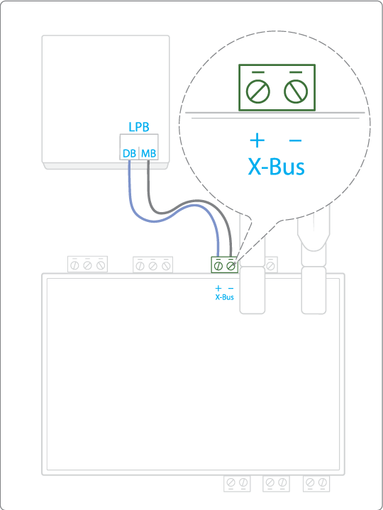

Pour paramétrer chacun des équipements

* Par précaution, vérifier que l’équipement n’alimente pas le bus LPB.
* Pour chaque équipement, paramétrer une adresse de segment (segment number) unique (de 1 à 14).
* Paramétrer son numéro d’équipement (Device Number) à 1.
* Procéder à la connexion comme indiqué.
* Désigner un et un seul équipement comme celui alimentant le bus.

== Pour connecter la Box à des capteurs LoRaWAN

Installer la Box :

* Installer la Box en un lieu central permettant d’assurer la réception de tous les capteurs.
* Si la qualité du signal LoRa est bonne : conserver l’antenne d’origine installée sur la Box.
+
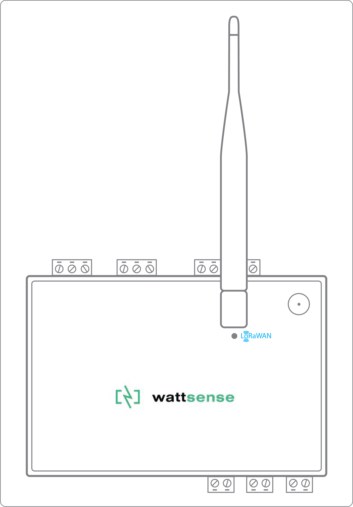

* Si la qualité de signal est insuffisante : déporter l’antenne d’origine à l’extérieur de l’armoire ; utiliser une rallonge de câble RF avec connecteur SMA de 2 mètres maximum + 1 support adhésif pour maintenir l’antenne.
* Si la qualité de signal est toujours insuffisante : utiliser une antenne Grand Gain avec au maximum 10 mètres de câble ; cette antenne peut par exemple être déportée à l’extérieur ou dans les étages pour obtenir la meilleure qualité de signal.

Pour chaque capteur :

* Ajouter le capteur sur la {ws-console}[console utilisateur] en le nommant pour qu’il soit identifiable.
* Envoyer la configuration à la Box.
* Activer le capteur ; pour ce faire, utiliser la documentation technique du fabricant.
* Vérifier sur la console utilisateur que le capteur est bien détecté.
